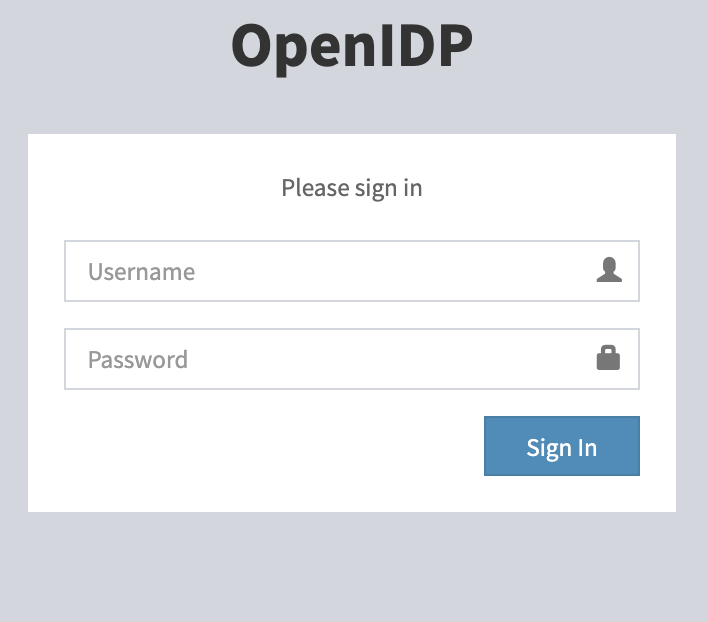
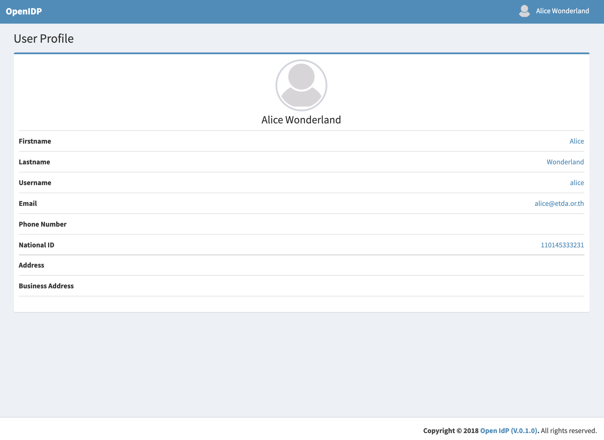

# OpenIDP 

### Project Summary

OpenIDP is an open-source project created to be a testing IdP. OpenIDP currently is still in development process and there are a lot to be done. However, it can work as a test base for OpenID Connect 1.0. No security is guaranteed. DO NOT USE THIS CODE IN PRODUCTION


### Prerequisite
 - MongoDB
 - Node.js


### Installation

```bash
git clone https://github.com/pepsi7959/open-idp.git
cd open-idp
npm install
node seed.js
```

### Run

```bash
vi config.json     # edit configuration for your environment
vi db/mongoose.js  # edit location of moongodb
npm start
```

### Run with docker-compose.xml
   The easist way to use contrainer is docker-compose.xml. It includes IDP and MongoDB
   
```bash

services:
  web:
    build: .
    ports:
      - "8888:3002"
    depends_on:
      - mongo
  mongo:
    image: mongo
    ports:
      - 27017
    volumes:
      - ./data/mongo:/data/db

```


### Usage

```bash
go to http://localhost:3002       # this is the default port
username: alice, password: 1234   # this is the default username/password from seed.js
```

### example 
    Login page will be displayed if no error.
    


    You can see a profile's alice. And you also change it later by provisioning to mongoDB.

